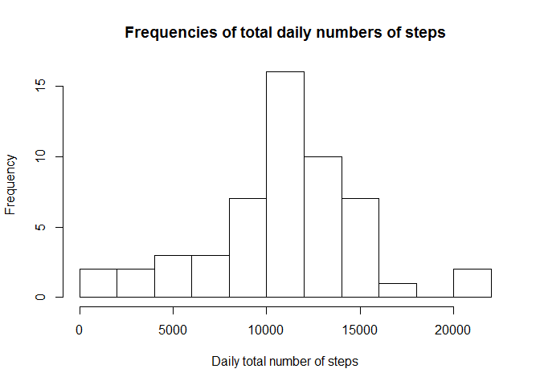
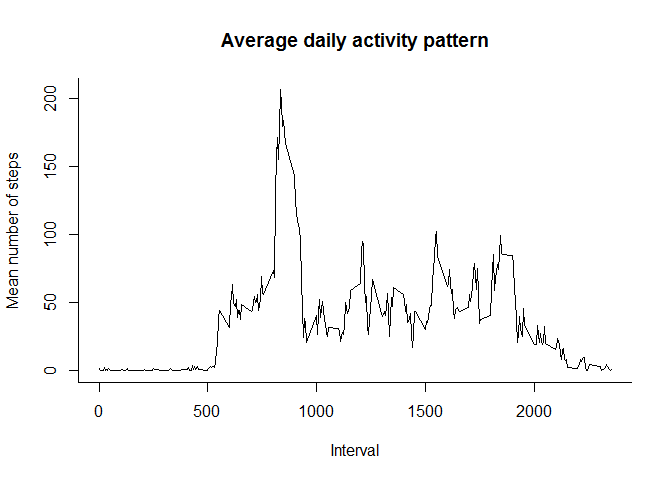
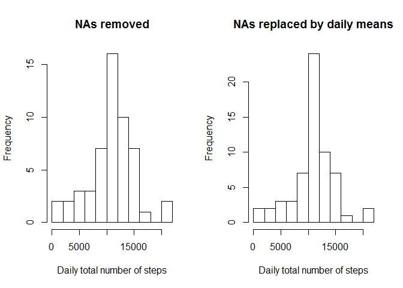
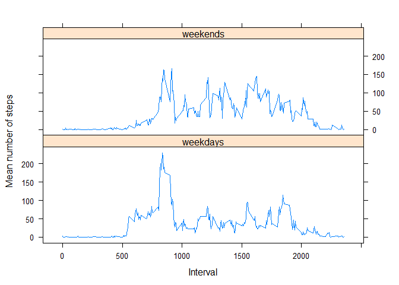

Reproducible Research Assignment 1
================

Loading and preprocessing the data
----------------------------------

``` r
## set working directory
d <- read.csv("activity.csv", header = T)
```

What is mean total number of steps taken per day?
-------------------------------------------------

> > For this part of the assignment, you can ignore the missing values in the dataset. I removed the NA values in the dataset by including only complete rows:

``` r
workingData <- d[complete.cases(d),] 
```

> > Calculate the total number of steps taken per day

``` r
dailyTotals <- aggregate(steps ~ date, workingData, sum)
dailyTotals 
```

    ##          date steps
    ## 1  2012-10-02   126
    ## 2  2012-10-03 11352
    ## 3  2012-10-04 12116
    ## 4  2012-10-05 13294
    ## 5  2012-10-06 15420
    ## 6  2012-10-07 11015
    ## 7  2012-10-09 12811
    ## 8  2012-10-10  9900
    ## 9  2012-10-11 10304
    ## 10 2012-10-12 17382
    ## 11 2012-10-13 12426
    ## 12 2012-10-14 15098
    ## 13 2012-10-15 10139
    ## 14 2012-10-16 15084
    ## 15 2012-10-17 13452
    ## 16 2012-10-18 10056
    ## 17 2012-10-19 11829
    ## 18 2012-10-20 10395
    ## 19 2012-10-21  8821
    ## 20 2012-10-22 13460
    ## 21 2012-10-23  8918
    ## 22 2012-10-24  8355
    ## 23 2012-10-25  2492
    ## 24 2012-10-26  6778
    ## 25 2012-10-27 10119
    ## 26 2012-10-28 11458
    ## 27 2012-10-29  5018
    ## 28 2012-10-30  9819
    ## 29 2012-10-31 15414
    ## 30 2012-11-02 10600
    ## 31 2012-11-03 10571
    ## 32 2012-11-05 10439
    ## 33 2012-11-06  8334
    ## 34 2012-11-07 12883
    ## 35 2012-11-08  3219
    ## 36 2012-11-11 12608
    ## 37 2012-11-12 10765
    ## 38 2012-11-13  7336
    ## 39 2012-11-15    41
    ## 40 2012-11-16  5441
    ## 41 2012-11-17 14339
    ## 42 2012-11-18 15110
    ## 43 2012-11-19  8841
    ## 44 2012-11-20  4472
    ## 45 2012-11-21 12787
    ## 46 2012-11-22 20427
    ## 47 2012-11-23 21194
    ## 48 2012-11-24 14478
    ## 49 2012-11-25 11834
    ## 50 2012-11-26 11162
    ## 51 2012-11-27 13646
    ## 52 2012-11-28 10183
    ## 53 2012-11-29  7047

> > Make a histogram of the total number of steps taken each day

``` r
hist(dailyTotals$steps, breaks = 10, xlab = "Daily total number of steps",
ylab = "Frequency", main = "Frequencies of total daily numbers of steps")
```



> > Calculate and report the mean and median of the total number of steps taken per day

``` r
mean(dailyTotals$steps)
```

    ## [1] 10766.19

``` r
median(dailyTotals$steps)
```

    ## [1] 10765

What is the average daily activity pattern?
-------------------------------------------

> > Make a time series plot (i.e. type = "l") of the 5-minute interval (x-axis) and the average number of steps taken, averaged across all days (y-axis)

``` r
averagedDaily <- aggregate(steps ~ interval, workingData, mean)
plot(averagedDaily$interval, averagedDaily$steps, type = "l", bty = "l",
xlab = "Interval", ylab = "Mean number of steps", main = "Average daily activity pattern")
```



> > Which 5-minute interval, on average across all the days in the dataset, contains the maximum number of steps?

``` r
ordered <- averagedDaily[rev(order(averagedDaily$steps)),]
ordered[1,]
```

    ##     interval    steps
    ## 104      835 206.1698

Answer is Interval \#835

Imputing missing values
-----------------------

> > Calculate and report the total number of missing values in the dataset (i.e. the total number of rows with NAs)

``` r
summary(d$steps)
```

    ##    Min. 1st Qu.  Median    Mean 3rd Qu.    Max.    NA's 
    ##    0.00    0.00    0.00   37.38   12.00  806.00    2304

> > Create a new dataset that is equal to the original dataset but with the missing data filled in.

``` r
averagedDaily <- aggregate(steps ~ interval, workingData, mean)
df2 <- merge(x = d, y = averagedDaily, by = "interval")
##inspect df2
df2[1:10,]
```

    ##    interval steps.x       date  steps.y
    ## 1         0      NA 2012-10-01 1.716981
    ## 2         0       0 2012-11-23 1.716981
    ## 3         0       0 2012-10-28 1.716981
    ## 4         0       0 2012-11-06 1.716981
    ## 5         0       0 2012-11-24 1.716981
    ## 6         0       0 2012-11-15 1.716981
    ## 7         0       0 2012-10-20 1.716981
    ## 8         0       0 2012-11-16 1.716981
    ## 9         0       0 2012-11-07 1.716981
    ## 10        0       0 2012-11-25 1.716981

``` r
colnames(df2) <- c("interval", "steps", "date","steps.imputed")
##replace NAs with imputed step values
df2$steps[is.na(df2$steps)] <- df2$steps.imputed[is.na(df2$steps)]
```

> > Make a histogram of the total number of steps taken each day and Calculate and report the mean and median total number of steps taken per day. Do these values differ from the estimates from the first part of the assignment? What is the impact of imputing missing data on the estimates of the total daily number of steps?

``` r
par(mfrow = c(1,2))
dailyTotalsImputed <- aggregate(steps ~ date, df2, sum)
hist(dailyTotals$steps, breaks = 10, xlab = "Daily total number of steps",
     ylab = "Frequency", main = "NAs removed")
hist(dailyTotalsImputed$steps, breaks = 10, xlab = "Daily total number of steps",
     ylab = "Frequency", main = "NAs replaced by daily means")
```



Mean and median values with NAs removed:

``` r
mean(dailyTotals$steps)
```

    ## [1] 10766.19

``` r
median(dailyTotals$steps)
```

    ## [1] 10765

Mean and median values with NAs replaced by daily means:

``` r
mean(dailyTotalsImputed$steps)
```

    ## [1] 10766.19

``` r
median(dailyTotalsImputed$steps)
```

    ## [1] 10766.19

In this instance there is very little difference in the mean and median values generated. However, it is clear that the frequency values change substantially when adding the imputed values.

Are there differences in activity patterns between weekdays and weekends?
-------------------------------------------------------------------------

Use the dataset with the filled-in missing values for this part.

> > Create a new factor variable in the dataset with two levels - "weekday" and "weekend" indicating whether a given date is a weekday or weekend day.

``` r
df2$dayType <- ifelse(weekdays(as.Date(df2$date)) %in% c("Saturday", "Sunday"), "weekend", "weekday")
```

> > Make a panel plot containing a time series plot (i.e. type = "l") of the 5-minute interval (x-axis) and the average number of steps taken, averaged across all weekday days or weekend days (y-axis). See the README file in the GitHub repository to see an example of what this plot should look like using simulated data.

``` r
## Calculating averages for weekdays and weekends
weekdays <- subset(df2, dayType == "weekday")
averagedWeekDays <- aggregate(steps ~ interval, weekdays, mean)
averagedWeekDays$dayType <- "weekdays"
weekends <- subset(df2, dayType == "weekend")
averagedWeekEnds <- aggregate(steps ~ interval, weekends, mean)
averagedWeekEnds$dayType <- "weekends"
df3 <- rbind(averagedWeekDays,averagedWeekEnds)
## generating the plot
library(lattice)
xyplot(steps ~ interval | dayType, data = df3, type = 'l', 
       layout = c(1,2), xlab = "Interval", ylab = "Mean number of steps")
```


